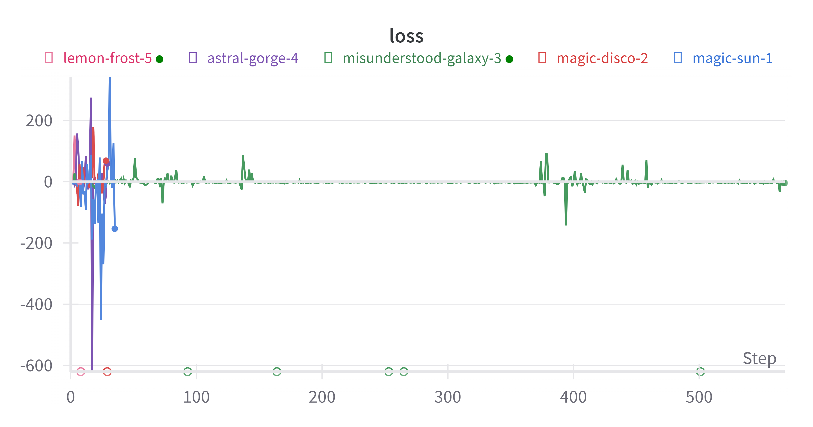

# GFN_to_ARC

`Try to Apply GFlowNet([Bengio et al., 2021](https://proceedings.neurips.cc/paper/2021/file/e614f646836aaed9f89ce58e837e2310-Paper.pdf)) to ARC`

And I am reffering Github repositories from [August](https://github.com/augustwester/gflownet) and [Official MILA](https://github.com/saleml/torchgfn)

## Process

11/23

- - ARCLE에서 발생하는 문제는 해결
- 특정 경우에 Nan이 발생
  - gradient clipping으로 어느정도 잡았으나, 700epoch를 잘 돌아가다가도 nan이 발생
  - 근본적으로 loss가 음수기 때문에 발생하는 거 같음 → **reward 수정 필요**
  
  - 1000epoch을 학습하도록 설정되어있는데, 끝까지 학습을 완료한 경우 한 번 있었음
- total flow를 1에서 1000으로 바꿈 → 효과 없음, 논문에서 total flow를 어떻게 설정하는 지 봐야할 거 같음.
  - reward의양이랑 같아야하는거같은데,, → prob의 합을 계속해서 더하도록 total flow를 만
- backward probability가 현재는 foward probability를 나누어서 계산하는 방식으로 되어있는데 네트워크를 따로 설계하는 방식으로 해봐도 좋을 듯
